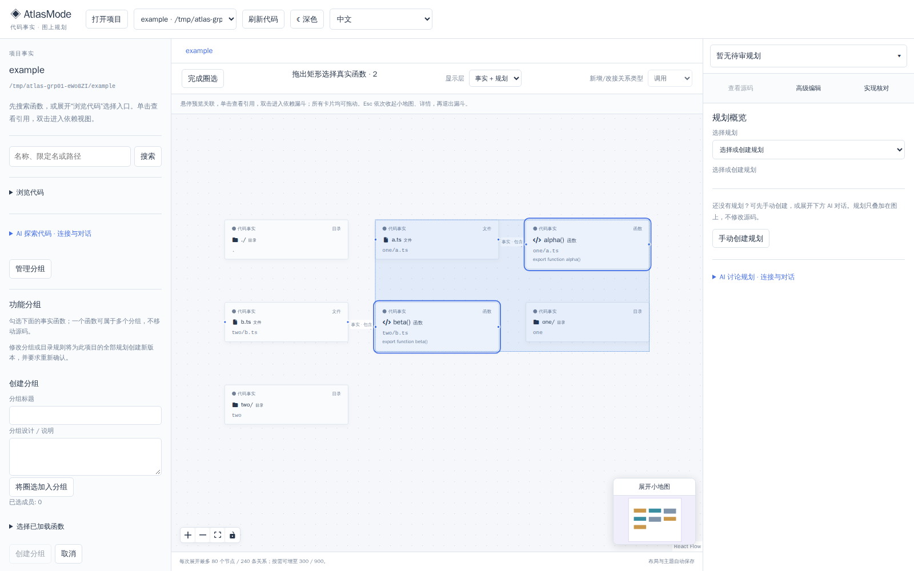
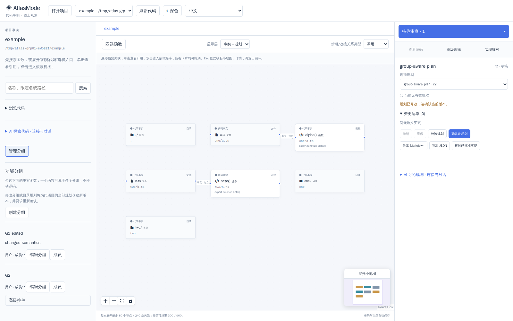

# GRP-01 实施与验收（2026-10-10 UTC）

实现已留在 fix/first-use-20261010 工作区，基线首用提交 078fa84。没有 commit/push/deploy、没有改 indexer 或其它任务服务进程。共享首用 UI 和 AGENTS 保留。

## 结果

显式圈选模式支持实际矩形选择真实函数，排除新增规划函数、文件和目录，真实移动/待删函数仍可加入。退出模式恢复检查/漏斗/拖动。分组编辑器直接可达；G1/G2 可共享真实函数；已有组按原 ID 编辑、保留 source、完整成员 ID 草稿支持超过20成员、圈选并集、显式删除、取消。项目切换清空草稿/选择。

保存后服务器返回的规划批准状态为准；可见成员分页刷新，独立成员导航序号区分切换分页与绑定读取完成，避免旧读取留下已删除成员。绑定名称/缺失状态只采用当前快照。未加载成员显示 ID 并保留；缺失成员不会静默删除。当前分页已确认缺失的成员须显式移除；未加载缺失由现有后端校验拒绝，未声称全组预验。

## 精确验证

- 新行为TDD：初次 editGroup 缺失/分页刷新失败，选择helper缺失；实现后通过。
- 真实圈选TDD：旧web dist无圈选按钮；新browser捕获受控selection effect反馈React185及再次圈选旧selected残留，两者已按输入边界/权威ID基线修复。
- 评审竞态TDD：保存期间旧成员读取完成，实际得到 f23,f24 而期望 f23；导航序号修复。
- 缺失快照TDD：旧snapshot missing禁用已恢复成员保存；同snapshot guard修复。当前snapshot missing仍保留ID、展示显式移除并禁保存。
- `npx vitest run apps/web/src`：126 tests / 27 files PASS（见 web-tests.log）。
- 限定GRP文件 eslint：退出0，0错误（lint.log）。
- `npm run build -w @codemap/web`：退出0；保留Vite >500kB建议（web-build.log）。未跑root build、不重建server、未声称覆盖AG05。
- `npx playwright test tests/e2e/groups.spec.ts tests/e2e/first-use.spec.ts --output=artifacts/e2e/grp01-final`：2/2 PASS（browser-final.log）；使用已安装Playwright Chromium，独立随机端口生产测试服务。

实际浏览器建立跨目录 one/a.ts alpha + two/b.ts beta 的 G1，矩形选择 alpha 建G2，确认共享ID；G1同ID修改title/description并删除beta，组总数仍2；规划批准UI有效变为无效；重载和仅本测试自有生产服务重启后组/编辑/无效批准仍在SQLite。两个源文件逐字节 Buffer 比较相等、目录和路径保持，pageerrors及外网请求均为空。截图已实际查看：

## 审查与限制

父设计代理完成独立设计评审；独立 grp01_review 实现审查 APPROVE，原成员分页竞态P2通过RED/GREEN关闭。随后同快照缺失guard补漏已按RED/GREEN验证。
完整root测试/build由主控协调，不把此处scoped测试当root结果。服务验收使用既有server dist快照；不覆盖正在实施的AG05。没有剩余GRP阻塞项。

Ruling：先用memberPage对象identity守护导航，独立评审证明绑定结果替换对象会误当导航；改用独立导航序号加group/offset/snapshot守护。代价是一个内部计数器，不更改存储/API契约。
Deferred minors：Vite现有bundle-size建议保留。
