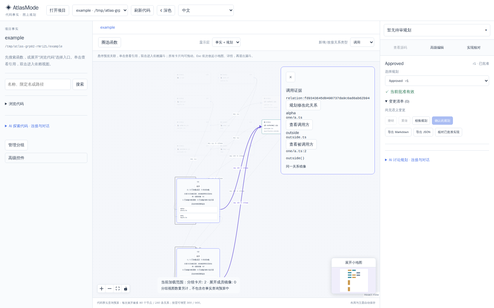
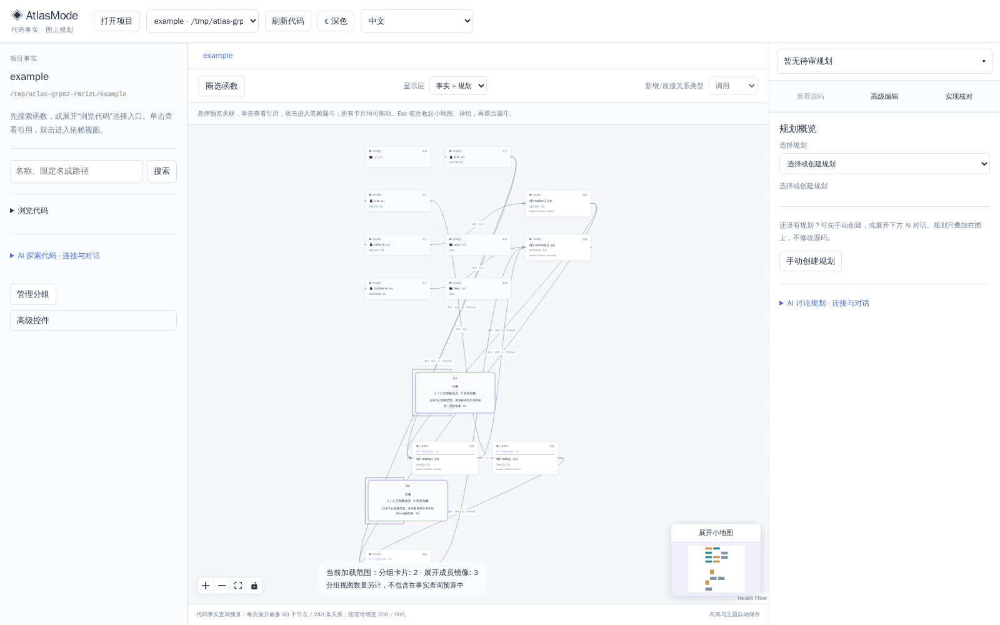

# GRP-02 验收与交接（2026-10-10）

本轮实现范围完成，独立复审 **APPROVE**。分组卡片可折叠/展开，共享函数采用明确标识的独立视图镜像；折叠关系保留真实函数端点、关系身份与文件行号证据。全仓暂存树 clean 集成已完成，见 [integration receipt](integration/README.md)；权威文档状态与提交由主控统一处理。本代理交付源码及证据，未 commit/push/deploy。

## 使用与语义

图中组卡片的“折叠/展开”保存当前项目视图；完整分组仍由“管理分组”操作。只有与当前已加载真实函数相交的组进入画布，卡片显示 loaded/total/unknown。共享成员显示“同一函数镜像”，其物理文件/parentId/domainID保持原值。点击外部事实关系可查看原 relationID、真实来源/目标及 evidence file:line/text，再检查真实函数源码或规划修改关系；展开镜像的规划 Handle 也使用真实函数ID。

折叠ID可选字段为 `ViewState.collapsedGroupIds`，最多200项、每项1–200字符，去重并过滤当前项目不存在/外项目/旧组ID；旧view未带字段保持兼容。既有JSON存储直接保存。布局与视图保存保持已批准规划有效，明确规划修改按原审批流程更新修订。圈选/漏斗临时呈现基础事实视图，结束后恢复保存的折叠状态。

## 最终门禁

| 门禁 | 实际结果 | 证据 |
| --- | --- | --- |
| 完整 web 单测与 owned view HTTP/SQLite integration | 141/141，35文件 PASS | [日志](web-unit-final.log) |
| 纯投影与旧 inspection/projection 定向回归 | 23/23，5文件 PASS | [初期GREEN](projection-view-green.log) |
| 项目边界/当前snapshot/full-member/HTTP回归 | 41/41，14文件 PASS（I1新增回归另见下一行） | [日志](scoped-green.log) |
| I1局部范围回归 | RED 1失败/4通过 → GREEN5/5 | [RED](review-scope-red.log)、[GREEN](review-scope-green.log) |
| 实际默认卡片重叠 | RED 78.35px → 最终browser几何断言PASS | [RED](spacing-browser-red.log)、[GREEN](browser-final.log) |
| 实际 Chromium / owned production server | 3/3 PASS，20.1秒 | [日志](browser-final.log) |
| 核心/服务/server定向编译、最终web build | PASS；web原有大于500KB分块警告保留 | [web日志](web-build.log)、工具实际core/service/server成功输出 |
| scoped ESLint、git diff --check | PASS | [lint](lint.log)及实际命令结果 |
| 独立设计/代码复审 | APPROVE；0 C/I | [结论](independent-review.md) |

生产source与相关编译产物哈希见 [compiled snapshot](compiled-snapshot.json)。最终源码快照使用现有首用/GRP01/AG05/IDX协作结果，验证结论仅覆盖本表与GRP02范围。源码/布局检查在真实夹具内使用字节比较与物理路径清单。

Browser 3项：first-use offline/disclosure、GRP01实际矩形圈选/完整成员编辑/共享成员与批准失效、GRP02两组fold/expand/evidence/source/layout/reload/owned-server restart。GRP02检查原始函数alpha/beta跨目录，G1与G2共享alpha；折叠后alpha→outside有两条镜像route且同一真实relationID，实际鼠标点击其无遮挡路径点显示原文件行号；检查调用方加载真实source；真实alias单击及Handle拖动保存must_call，HTTP读取确认真实sourceId/targetId；检查视图保存不使批准失效、显式规划编辑另更新；页面错误与外部请求均为0。

此前RED中包含组件测试依赖错误，已改为项目现有renderToStaticMarkup；该错误不作为产品RED。projection/helper缺失、服务拒绝新view、workspace缺少toggle行为、旧dist缺少卡片及审查/几何RED是实际行为验证。最终结果以本表日志为准。

## 范围与预算

事实查询budget单独标示，分组卡片/展开成员镜像数量另计并显示当前范围。设N为基础节点，U为已归组真实函数，G为与加载范围相交组，M_expanded为展开组加载成员总数，则N'=N−U+G+M_expanded；每原关系最多1+g(source)+g(target)条视觉route，同一relation内去重与折叠内部自环隐藏会减少。15组交叠测试每关系15条，非225；50范围外组不增加卡片。组存储总数没有新增硬上限，PERF-02全局布局/大规模体验保持后续范围。未加载成员/邻域未知，卡片与证据支持已加载范围；本轮不产生新事实边、不移动源码、不实施规划，不扩sequence/wrapper。

## neat-freak v3 收尾矩阵

| 事实面 | 状态 | 处理与边界 |
| --- | --- | --- |
| 代码 | changed-and-verified | 当前typed schema、pure projection/domain映射/所有本轮门禁与独立审查 |
| 运行态 | changed-and-verified | owned tempDB/randomport production fixture、真实Chromium及owned restart；生产发布不在本轮范围 |
| 文档 | changed-and-verified / pending | 主控已同步根README/coverage/state/GRP02票DONE；原始失败与独立审查保留 |
| 规则 | verified-current | 项目/全局AGENTS与CLAUDE路径实际读取；用户AGENTS修改原样保留，vendored skills原样保留 |
| 记忆 | out-of-scope | generated-read-only；保留平台生成入口，未读取别人会话或写机器生成记忆 |
| 工作区 | verified-current / pending | 只读全项目路径inventory；保留共享checkout/其他代理diff/唯一证据；集成由主控完成 |

只读 [inventory](inventory.log)机械枚举规则链、Markdown与git/worktree元数据（1个现有worktree）。本次有复核价值的中间日志归本目录；owned夹具由测试自身释放，仓库/技能/分支/共享工作区保留。无需破坏性清场。独立 archive clean full-root gates已执行并记录于 [integration receipt](integration/README.md)；剩余为主控权威状态同步与最终提交，PERF-02与未加载范围按上文保留；web chunk warning保留。

主控核对：15项暂存产品SHA与冻结收据一致，无IDX03/POL01/KN01后续产品候选；真实截图已查看。最终规划helper限定high复审C0/I0/M0 APPROVE，原文见 [审查](integration/independent-planning-helper-review.md)。
